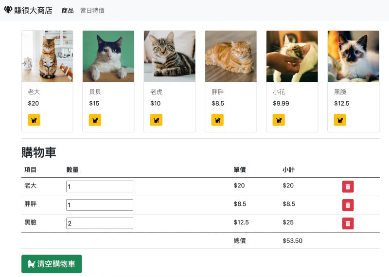

# Shopping Cat Practice with Vanilla JavaScript

## Description

- This is a practice project made by Eddie Kao (eddie@5xcampus.com)
- Only the JavaScript files in src/scripts were written by me.
- This project is a shopping cart web app that allows users to add cats to the cart and update the amount,
  and total price will be calculated automatically.

## Tech Stacks

- Fontawesome
- Bootstrap
- Parcel

## Setup Steps

- Make sure `yarn` is installed.
- Run `yarn install` to install all packages.
- Run `yarn run dev` or `yarn dev` to run a development server on your local machine.

photo credits: [unsplash](https://unsplash.com/)
